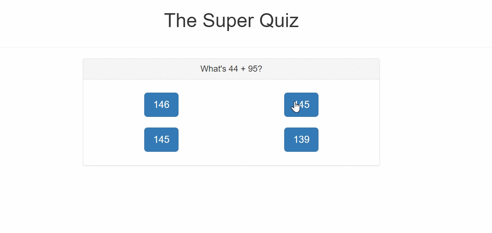
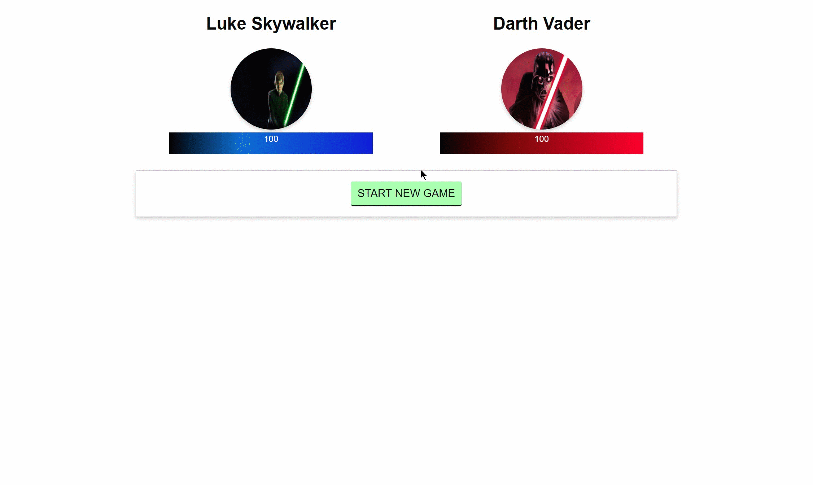

# Vue-JS-Exercises
Small projects I worked on while going through the Udemy Vue JS - The Complete Guide (https://www.udemy.com/course/vuejs-2-the-complete-guide/)

## Projects
### QuizApp

### StarWars-Fighter

### Quotes-VueJS


## Exercises

### AnimationsAndTransitions

### Forms

### MoreForms

### SharingComponents

### Components

### FiltersAndMixins

### MoreDirectives

### Slots

# vue-cli

> A Vue.js project

## Choose Project & Build Setup

``` bash
# install dependencies
npm install

# serve with hot reload at localhost:8080
npm run dev

# build for production with minification
npm run build
```

For detailed explanation on how things work, consult the [docs for vue-loader](http://vuejs.github.io/vue-loader).
