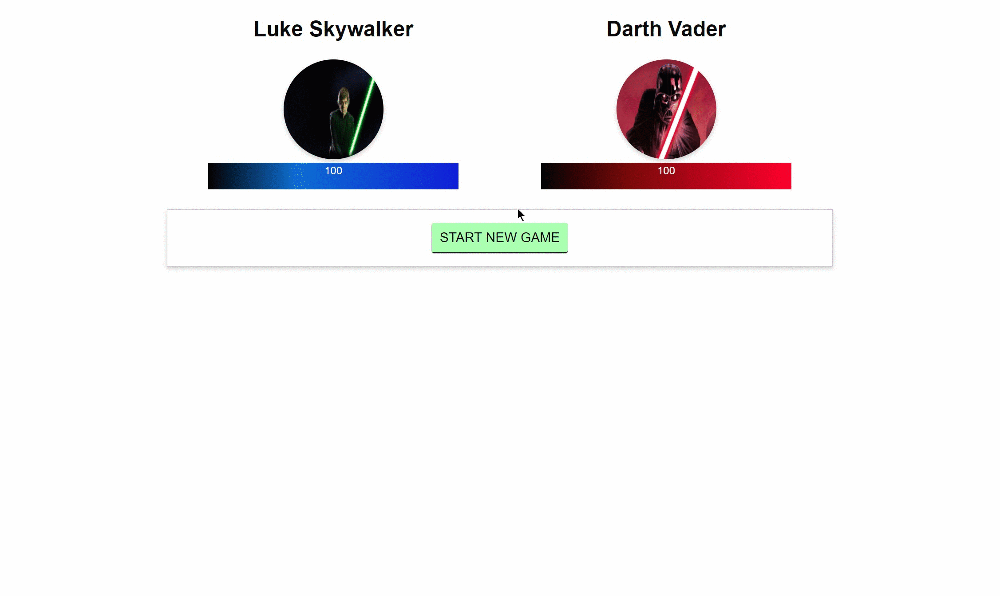

# Vue-JS-Exercises
Small projects I made while learning how to use Vue JS

## QuizApp

## AnimationsAndTransitions

## Forms

## MoreForms

## StarWars-Fighter


## Quotes-VueJS

## SharingComponents

## Components

## FiltersAndMixins

## MoreDirectives

## Slots


# vue-cli

> A Vue.js project

## Choose Project & Build Setup

``` bash
# install dependencies
npm install

# serve with hot reload at localhost:8080
npm run dev

# build for production with minification
npm run build
```

For detailed explanation on how things work, consult the [docs for vue-loader](http://vuejs.github.io/vue-loader).
